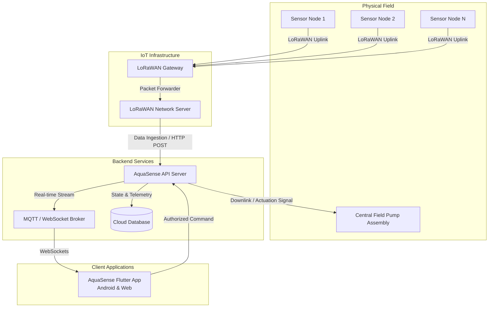
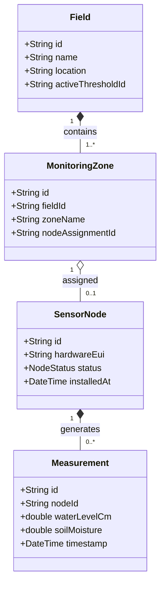
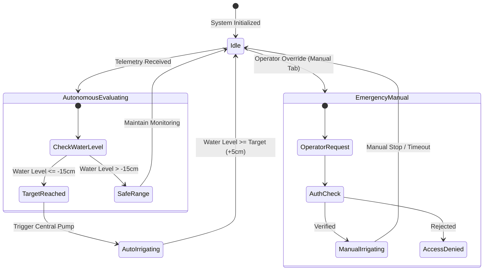

# AquaSense: Alternate Wetting and Drying (AWD) Smart Irrigation & Telemetry Platform

[](https://flutter.dev)
[](https://dart.dev)
[](https://flutter.dev)
[](https://github.com/openspec/openspec)

AquaSense is an enterprise-grade IoT smart agriculture platform engineered for precision **Alternate Wetting and Drying (AWD)** water management in rice paddies. The platform integrates long-range LoRaWAN telemetry nodes, edge node autonomous decision-making engines, real-time WebSocket event streams, field-scoped security controls, and centralized irrigation management to optimize agricultural yield while reducing water consumption by up to 30%.

> [!IMPORTANT]
> **Core Architectural Paradigms**:
> 1. **Node Autonomous Decision Making**: Irrigation needs are calculated automatically based on continuous water-level readings captured by sensor nodes deployed across monitoring zones.
> 2. **Centralized Field Irrigation**: Individual monitoring zones function strictly as telemetry acquisition points. Pumping actuation is controlled centrally at the field level.
> 3. **Emergency Resort & Manual Fallback**: Manual and centralized pump overrides are reserved strictly for emergency intervention, system testing, or manual override within the dedicated Manual tab.

---

## Table of Contents

- [1. Project Overview](#1-project-overview)
- [2. System Architecture](#2-system-architecture)
- [3. Monitoring Architecture](#3-monitoring-architecture)
- [4. Irrigation Architecture](#4-irrigation-architecture)
- [5. Authentication & Authorization](#5-authentication--authorization)
- [6. Audit Logging](#6-audit-logging)
- [7. IoT / LoRaWAN Architecture](#7-iot--lorawan-architecture)
- [8. AWD Analysis & Decision Engine](#8-awd-analysis--decision-engine)
- [9. Repository Structure](#9-repository-structure)
- [10. Development Setup](#10-development-setup)
- [11. Configuration](#11-configuration)
- [12. Running the System](#12-running-the-system)
- [13. Testing](#13-testing)
- [14. API & Integration Overview](#14-api--integration-overview)
- [15. Security](#15-security)
- [16. Deployment](#16-deployment)
- [17. OpenSpec Development Workflow](#17-openspec-development-workflow)
- [18. Current Implementation Status](#18-current-implementation-status)
- [19. Roadmap](#19-roadmap)
- [20. Contribution & Development Guidelines](#20-contribution--development-guidelines)
- [21. Troubleshooting](#21-troubleshooting)

---

## 1. Project Overview

### Purpose
Conventional flooded rice cultivation requires immense water volumes and contributes significantly to agricultural methane emissions. **Alternate Wetting and Drying (AWD)** is a proven water-management technique where rice fields are periodically flooded and allowed to dry naturally until soil water levels decline to a critical depth (typically $-15\text{ cm}$) before reflooding. 

AquaSense automates and digitizes the AWD protocol by collecting real-time water depth and soil conditions from multi-node telemetry networks, executing field-level AWD rule evaluations, and driving autonomous or operator-approved irrigation actuation.

### Core Objectives
- **Dynamic Field Topology**: Support arbitrary numbers of monitoring zones ($1\dots N$) per field without legacy fixed quadrant assumptions.
- **Autonomous Decision Engine**: Process telemetry streams to generate real-time reflood recommendations based on active field thresholds.
- **Centralized Actuation & Safety Guardrails**: Execute field-level pump control with safety lockouts, fault detection, and manual emergency fallbacks.
- **Cross-Platform Access**: Provide reactive mobile (Android) and Web interfaces for field operators, agronomists, and system administrators.
- **Auditability**: Capture server-side, immutable audit logs for all security, telemetry, and irrigation events.

---

## 2. System Architecture

AquaSense follows a decoupled, event-driven IoT architecture spanning physical field sensors, gateway network servers, backend microservices, and client applications.



### Data Flow Overview
1. **Telemetry Acquisition**: Sensor nodes measure hydrostatic pressure (water level) and soil parameters, transmitting packed binary payloads via LoRaWAN uplinks.
2. **Ingestion & Processing**: The LoRaWAN Network Server routes payloads to backend API ingestion endpoints, which decode, validate, and store raw telemetry measurements.
3. **Analytics & Evaluation**: The AWD Rule Engine aggregates active zone measurements, evaluates field thresholds, updates field status, and publishes real-time WebSocket state packages.
4. **Actuation Command**: Upon autonomous trigger or authorized emergency override, control signals are routed to the central field pump controller.

---

## 3. Monitoring Architecture

### Dynamic Zone Mapping
Monitoring zones are dynamically allocated per field and are **not hardcoded**. A field may contain $1$ to $N$ monitoring zones depending on paddy dimensions, topography, and elevation variations.



### Entity Hierarchy
- **Field**: Top-level agricultural unit governed by a central irrigation system.
- **Monitoring Zone**: Sub-region of a field designated for localized environmental observation.
- **Sensor Node**: Physical IoT device hardware with a unique Device EUI. Nodes can be registered, reassigned, replaced, or decommissioned.
- **Sensor**: Physical transducer (e.g., pressure sensor, soil moisture probe) attached to a node.
- **Measurement**: Immutable point-in-time sensor reading linked to the generating node and zone. Historical records persist across device reassignments.

---

## 4. Irrigation Architecture

### Autonomous Node-Driven Irrigation vs. Centralized Actuation
1. **Observation**: Monitoring nodes capture water depth across field micro-topographies.
2. **Decision Generation**: The AWD decision engine computes aggregated field water levels. If water levels reach the critical AWD threshold (e.g., $-15\text{ cm}$), a reflood requirement is triggered automatically.
3. **Centralized Actuation**: Irrigation pumps are deployed at the field level. Individual monitoring zones do **not** independently control separate pumps.



### Emergency & Manual Overrides
- **Primary Mode**: Autonomous node-driven irrigation based on field AWD thresholds.
- **Emergency Resort**: Manual pump controls are available under the **Manual Control** tab for emergency water delivery, system priming, or hardware testing.
- **Safety Boundaries**: Manual actuation requires field-scoped `OPERATOR` or `ADMIN` privileges and strictly respects safety lockouts (e.g., thermal pump fault, low-voltage lockout).

---

## 5. Authentication & Authorization

### Field-Scoped Role-Based Access Control (RBAC)
User permissions are strictly scoped to specific field instances. Access credentials granted for Field A do not confer operational privileges for Field B.

| Role | Telemetry Viewing | Threshold Config | Manual Override | Node Provisioning | Audit History |
| :--- | :---: | :---: | :---: | :---: | :---: |
| **VIEWER** | Read-Only | ❌ | ❌ | ❌ | Read-Only |
| **OPERATOR** | Read-Only | Read-Only | ✅ | ❌ | Read-Only |
| **AGRONOMIST** | Read-Only | ✅ | ❌ | ❌ | Read-Only |
| **FIELD_ADMIN** | Full Access | Full Access | Full Access | ✅ | Full Access |

### Authentication & Session Management
- **Token Model**: Short-lived JSON Web Tokens (JWT) for API requests paired with secure refresh token rotation.
- **Secure Storage**: Mobile credentials are stored in encrypted hardware keystores (Flutter Secure Storage / Android KeyStore).
- **Session Lifecycles**: Automatic session invalidation upon privilege revocation or timeout.

---

## 6. Audit Logging

AquaSense logs all critical system operations server-side to maintain an unalterable record for compliance, safety verification, and operational diagnosis.

### Audit Log Entity Schema
```json
{
  "id": "audit_8f92a10b",
  "timestamp": "2026-09-25T14:32:00.000Z",
  "actor": {
    "type": "HUMAN",
    "id": "usr_4412",
    "role": "FIELD_ADMIN"
  },
  "action": "IRRIGATION_MANUAL_OVERRIDE_START",
  "target": {
    "type": "FIELD_PUMP",
    "id": "pump_field_01"
  },
  "result": "SUCCESS",
  "metadata": {
    "durationMinutes": 30,
    "reason": "Emergency reflood test",
    "ipAddress": "192.168.1.45"
  }
}
```

### Tracked Actions
- **Security**: Authentication successes/failures, password updates, role reassignments.
- **Device Management**: Node registration, hardware replacement, calibration parameter edits.
- **Control Actuation**: Autonomous irrigation starts/stops, manual emergency overrides, emergency abort triggers.
- **Configuration**: AWD threshold modifications, safety timeout adjustments.

---

## 7. IoT / LoRaWAN Architecture

### Telemetry Pipeline
1. **Sensors**: Submersible hydrostatic pressure transducers and capacitive soil moisture probes.
2. **Node Hardware**: Ultra-low-power LoRaWAN Class A / Class C end-nodes.
3. **Gateway Protocol**: Packet forwarder over Semtech UDP or Semtech Basics Station protocol.
4. **Network Server**: ChirpStack / TTN routing payloads via HTTP Webhooks or MQTT to backend ingestion services.

```
[ Sensor Node ] --(LoRaWAN 868/915 MHz)--> [ LoRaWAN Gateway ] --(MQTT/HTTPS)--> [ AquaSense Ingestion API ]
```

### Provisioning & Device Health
- **Provisioning**: OTAA (Over-The-Air Activation) using unique DevEUI, AppEUI, and AppKey combinations.
- **Device Telemetry**: Every uplink payload contains battery voltage ($V$), Signal-to-Noise Ratio (SNR), Received Signal Strength Indicator (RSSI), and sensor status flags.
- **Health Monitoring**: Nodes missing scheduled uplink windows transition to `STALE` and eventually `OFFLINE` status.

---

## 8. AWD Analysis & Decision Engine

### Threshold & Decision Principles
The AWD Decision Engine evaluates field water levels continuously using configured depth boundaries:

$$\text{Field Effective Level } (h_{\text{field}}) = \frac{1}{M} \sum_{i=1}^{M} h_{i}$$

Where $M$ is the count of active, non-stale monitoring nodes.

```
+-----------------------------------------------------------+  +20 cm (Overflow Limit)
|                      Paddy Surface                        |  0 cm
+-----------------------------------------------------------+
|               Safe Drying Zone (AWD Range)                |
+-----------------------------------------------------------+  -15 cm (Critical AWD Threshold -> REFLOOD)
|                 Root Stress Boundary                      |
+-----------------------------------------------------------+
```

### Telemetry Edge Case Handling
- **Unequal Water Distribution**: If elevation differences cause uneven drying, the engine highlights maximum drying zones to prevent crop distress.
- **Missing / Stale Data**: Nodes that drop offline are excluded from field averages. If active node coverage falls below $50\%$, the system flags a `TELEMETRY_DEGRADED` alert and prohibits autonomous pump start.
- **Observation vs. Actuation**: Monitoring zones observe conditions; the AWD engine evaluates rules; the field pump executes actuation.

---

## 9. Repository Structure

```
aquaflow_frontend/
├── android/                         # Native Android project configuration and manifests
├── assets/                          # Static assets (images, icons, mock data)
├── docs/                            # Project design documents and architecture specifications
├── lib/                             # Main Dart source code
│   ├── app/                         # Application setup, router, and themes
│   ├── core/                        # Global shared code
│   │   ├── constants/               # Color palettes, typography, dimensions
│   │   ├── network/                 # HTTP/WebSocket client wrappers
│   │   ├── theme/                   # Material design system configurations
│   │   └── utils/                   # Shared helpers, formatters, and validators
│   ├── features/                    # Feature-driven modular architecture
│   │   ├── auth/                    # Login, session management, RBAC guardrails
│   │   ├── awd/                     # AWD analytics screens, rule engine, trend charts
│   │   ├── field/                   # Field topology, zone management, field selector
│   │   ├── home/                    # Main field status overview dashboard
│   │   ├── irrigation/              # Central control & emergency manual override
│   │   ├── telemetry/               # Live sensor stream cards & node health
│   │   └── zones/                   # Zone detail views & node mapping
│   └── main.dart                    # Application entry point
├── openspec/                        # OpenSpec change control system
│   ├── AGENTS.md                    # OpenSpec agent execution rules
│   ├── PROJECT.md                   # Core project specification metadata
│   ├── changes/                     # Active, proposed, and archived OpenSpec changes
│   └── specs/                       # Main baseline domain specifications
├── test/                            # Automated test suite
│   ├── features/                    # Unit & Widget tests mirrored by feature
│   ├── mocks/                       # Mock classes and test fixtures
│   └── test_helpers/                # Test utilities and wrapper helpers
├── pubspec.yaml                     # Flutter package dependencies and environment constraints
└── README.md                        # Master root repository documentation
```

---

## 10. Development Setup

### Prerequisites
- **Flutter SDK**: `3.19.x` or higher (compatible with Dart `3.3.x`+)
- **Java Development Kit**: JDK 17 (for Android builds)
- **Android Studio / VS Code**: With Flutter and Dart plugins installed
- **Git**: For version control

### Local Installation
1. **Clone the repository**:
   ```bash
   git clone https://github.com/aquasense/aquaflow_frontend.git
   cd aquaflow_frontend
   ```

2. **Fetch dependencies**:
   ```bash
   flutter pub get
   ```

3. **Verify Flutter environment**:
   ```bash
   flutter doctor
   ```

---

## 11. Configuration

Application environments are configured via standard `.env` configuration files or environment compile-time flags.

### Environment Sample (`.env.example`)
```ini
# API Gateway Configuration
API_BASE_URL=https://api.aquasense.io/v1
WS_STREAM_URL=wss://api.aquasense.io/v1/telemetry/stream

# Feature Flags
ENABLE_MOCK_TELEMETRY=false
ENABLE_MANUAL_OVERRIDE=true

# Security Settings
SESSION_TIMEOUT_MINUTES=30
```

> [!CAUTION]
> **Secrets Handling**: Never commit real `.env` credentials, tokens, or private keys to source control. Production build assets must draw credentials from secure CI/CD secrets storage.

---

## 12. Running the System

### Run Desktop / Mobile App
```bash
# Target default connected device or emulator
flutter run

# Target specific Android device
flutter run -d <device_id>

# Run in Chrome (Web profile)
flutter run -d chrome
```

### Build Releases
```bash
# Build Android APK
flutter build apk --release

# Build Android App Bundle (AAB)
flutter build appbundle --release

# Build Flutter Web distribution
flutter build web --release
```

---

## 13. Testing

AquaSense maintains a rigorous testing protocol spanning unit tests, widget interaction tests, and mock telemetry scenarios.

### Execute Test Suites
```bash
# Run all unit and widget tests
flutter test

# Run tests with coverage reporting
flutter test --coverage

# Run specific feature tests
flutter test test/features/awd/awd_rule_engine_test.dart
```

### Static Analysis & Linting
```bash
# Run Dart static analyzer
dart analyze

# Format source code
dart format --set-exit-if-changed .
```

---

## 14. API & Integration Overview

### Primary API Contracts

| Endpoint | Method | Role Required | Description |
| :--- | :---: | :---: | :--- |
| `/api/v1/auth/login` | `POST` | Public | Authenticates credentials and returns JWT pair. |
| `/api/v1/fields/{id}` | `GET` | Viewer+ | Retrieves field topology, zones, and current state. |
| `/api/v1/telemetry/latest` | `GET` | Viewer+ | Fetches most recent sensor measurements by field. |
| `/api/v1/irrigation/manual` | `POST` | Operator+ | Initiates manual emergency pump override. |
| `/api/v1/irrigation/stop` | `POST` | Operator+ | Aborts active irrigation immediately. |
| `/api/v1/audit/logs` | `GET` | Field Admin | Queries server-side audit trails with filters. |

### Realtime Telemetry WebSocket
Clients connect to `/v1/telemetry/stream?fieldId={id}` using bearer token authentication to receive instant node reading broadcasts and pump state transitions.

---

## 15. Security

- **Data In Transit**: Mandatory TLS 1.3 encryption for all HTTP APIs and WebSockets (`https://` and `wss://`).
- **Data At Rest**: Encrypted client storage for token persistence.
- **Field Authorization**: Access tokens contain field-scoped claim masks preventing unauthorized cross-tenant operations.
- **Hardware Integrity**: LoRaWAN AES-128 key isolation for end-node uplink verification.

---

## 16. Deployment

### Android Deployment
Production builds produce signed App Bundles (`.aab`) configured for distribution via Google Play Store or private enterprise MDM servers.

### Web Deployment
Flutter Web artifacts generated in `build/web/` are deployable to static hosting platforms (Firebase Hosting, AWS S3 / CloudFront, Nginx).

---

## 17. OpenSpec Development Workflow

AquaSense uses [OpenSpec](https://github.com/openspec/openspec) to govern architecture changes and feature evolution.

```
openspec/
├── PROJECT.md             # Baseline project rules & domain context
├── specs/                 # Active main specification documents
└── changes/               # Proposed, active, and archived changes
    ├── archive/           # Completed historical changes
    └── change-name/       # Active proposal directory
        ├── proposal.md    # Feature motivation & design
        ├── specs/         # Delta specification changes
        └── tasks.md       # Implementation task list
```

---

## 18. Current Implementation Status

| Feature / Subsystem | Status | Description |
| :--- | :---: | :--- |
| **Field Topology & Selector** | `IMPLEMENTED` | Supports dynamic N-zone fields and real-time selection. |
| **Node Autonomous UI** | `IMPLEMENTED` | AWD rule engine displays reflood decisions based on telemetry. |
| **Emergency Manual Control** | `IMPLEMENTED` | Dedicated manual tab with emergency safety framing. |
| **Mock Telemetry Stream** | `IMPLEMENTED` | Real-time state simulation for offline testing. |
| **Audit Log Viewing** | `PARTIAL` | Client UI exists; backend integration ongoing. |
| **Direct LoRaWAN Gateway Config** | `PLANNED` | Provisioning gateway parameters directly from mobile app. |

---

## 19. Roadmap

1. **Phase 1 (Completed)**: Core AWD rule evaluation engine, dynamic N-zone UI, and manual override guardrails.
2. **Phase 2 (In Progress)**: Server-side audit log synchronization, multi-field agronomist dashboards.
3. **Phase 3 (Planned)**: AI-driven predictive water drying rate forecasting using local weather telemetry integration.

---

## 20. Contribution & Development Guidelines

1. **Branching Strategy**: Create feature branches off `main` using `feature/feature-name` or `fix/fix-name`.
2. **Commit Standards**: Write concise, descriptive commit messages adhering to Conventional Commits.
3. **Quality Gates**: Ensure `dart analyze` passes with zero warnings and all `flutter test` cases execute cleanly before filing pull requests.

---

## 21. Troubleshooting

| Issue | Cause | Resolution |
| :--- | :--- | :--- |
| **`RenderFlex overflowed`** | Unbounded column/row in narrow mobile viewport | Ensure text or action buttons are wrapped in `Expanded` or `Wrap`. |
| **`Telemetry Stale Warning`** | Mock timer or socket connection lost | Check server URL or restart mock stream in settings. |
| **`Build error on flutter pub get`** | Package version mismatch | Run `flutter clean` followed by `flutter pub get`. |

---
*For support or architectural inquiries, contact the AquaSense engineering team.*
