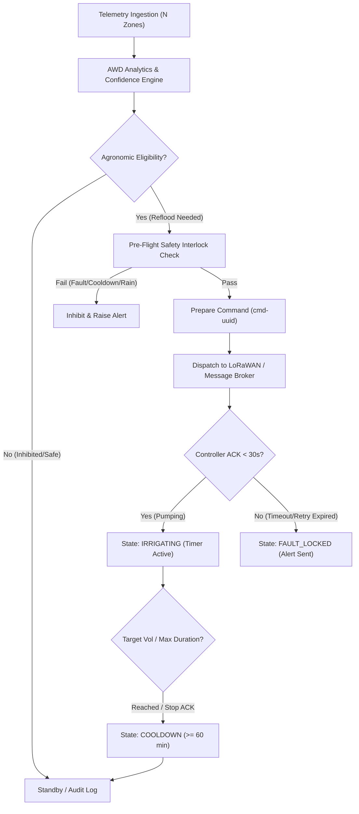

## Context

AquaSense currently operates with decoupled monitoring nodes, dynamic AWD analytics, and a single centralized field irrigation system. Field operators currently receive AWD recommendations and manually execute start/stop commands via `ControlScreen`.

This design establishes an autonomous, supervisory automatic irrigation control system that safely executes field-level irrigation based on aggregated multi-node AWD telemetry, while preserving the foundational invariant that irrigation control is strictly field-wide and centralized.

## Goals / Non-Goals

**Goals:**
- Implement a robust 7-state supervisor state machine: `disabled`, `standby`, `evaluating`, `pendingAck`, `irrigating`, `cooldown`, `faultLocked`.
- Decouple automated decision evaluation (agronomic rules) from actuation orchestration (physical safety, interlocks, communication protocols).
- Enforce pre-flight safety interlocks: controller connectivity, absence of alarms, telemetry confidence threshold ($\ge 0.75$), non-stale data, allowed time-of-day windows, and rain delay status.
- Implement reliable command lifecycle with correlation IDs, 30-second ACK timeouts, 2-retry limits, and fail-safe hardware watchdog timers.
- Distinguish system-triggered operations (`system/auto-awd`) from human operator actions (`user/<userId>`) in an immutable audit log.
- Architect domain models with extensible `systemId` support to accommodate future multi-system fields while deploying a single centralized controller today.

**Non-Goals:**
- Zone-level, branch-level, or quadrant-level actuation (strictly prohibited by system invariant).
- Direct peer-to-peer radio triggers between sensor nodes and pump hardware without backend supervisory control.
- Simultaneous multi-pump orchestration in the current release.

## Decisions

### 1. Backend-Supervised State Machine with Reactive Client Mirroring
- **Approach**: The automatic irrigation state machine resides on the backend/gateway service as the single source of truth, evaluating scheduled and telemetry-driven trigger conditions. The Flutter client consumes real-time state broadcasts over WebSocket/SSE and REST polling, displaying state banners, countdowns, and override controls.
- **Rationale**: An edge or backend supervisor ensures uninterrupted automation even when mobile operator devices are offline, locked, or backgrounded.
- **Alternatives Considered**:
  - *Client-driven automation*: Rejected because mobile operating systems kill background processes, leading to missed irrigations or unclosed valves.
  - *Controller-autonomous logic*: Rejected because sensor nodes report to the cloud/gateway via LoRaWAN; running heavy multi-zone aggregation on low-power ESP32 controller microcontrollers introduces unnecessary firmware complexity.

### 2. Decoupling Agronomic Eligibility from Supervisory Interlocks
- **Approach**: The `AwdRuleEngine` evaluates agronomic conditions to produce an `AwdAutomationEligibility` record containing:
  - `isEligibleForAutoIrrigation`: Boolean flag.
  - `recommendedDurationMinutes`: Calculated target fill time based on water deficit.
  - `inhibitionReasons`: List of active inhibitors (`disparityConflict`, `lowConfidence`, `staleTelemetry`).
  The supervisory control engine then checks physical/operational interlocks (controller online, cooldown expired, quiet hours, hardware alarms) before initiating dispatch.
- **Rationale**: Keeps agronomic AWD evaluation pure, testable, and separate from physical actuator safety constraints.



### 3. Controller-Side Hardware Watchdog Timer (Fail-Safe)
- **Approach**: The start command payload includes an explicit `maxDurationSeconds` (e.g. 2700s for 45 min). The ESP32 central controller firmware initializes an internal countdown timer upon opening the valve and starting the pump. If the stop command from the backend is delayed or lost due to network outage, the controller hardware autonomously shuts down the pump and closes the valve when the timer expires.
- **Rationale**: Guarantees zero risk of continuous runaway flooding even in catastrophic gateway or cloud disconnections.

### 4. Typed Audit Actor Model
- **Approach**: All irrigation events record `IrrigationActor`:
  ```dart
  class IrrigationActor {
    final IrrigationActorType type; // system, user, emergencyStop
    final String id; // 'auto-awd' or '<userId>'
    final String displayName;
  }
  ```
- **Rationale**: Cleanly segregates autonomous cycles from human interventions in compliance logs and UI history views.

## Risks / Trade-offs

- **[Risk: Stale or erratic sensor telemetry triggering improper irrigation]**  
  → *Mitigation*: Multi-factor confidence score requirement ($\ge 0.75$), physical bounds check ($\pm 35\text{ cm}$), MAD statistical outlier removal, and telemetry age timeout ($<45\text{ min}$).
- **[Risk: Conflicting zone moisture levels causing localized crop drowning]**  
  → *Mitigation*: Automatic irrigation is strictly inhibited whenever `hasConflictingConditions` is true (water depth spread $>8.0\text{ cm}$ with flooded zone $\ge 2.0\text{ cm}$).
- **[Risk: Operator unaware of automated start while working in the field]**  
  → *Mitigation*: 60-second audible/visual pre-start warning buzzer on physical controller, immediate push notification and WebSocket alert broadcast to mobile apps, and instant Emergency Stop accessibility.
- **[Risk: Rapid successive cycles causing soil waterlogging]**  
  → *Mitigation*: Mandatory minimum cooldown period (minimum 60 minutes, configurable up to 240 minutes) enforced by the state machine after every cycle.

## Migration Plan

1. Deploy backward-compatible DTOs and models with optional `autoIrrigationConfig` and `actor` metadata.
2. Initialize existing fields with `autoIrrigationState: disabled` by default, requiring deliberate operator enablement.
3. Update `ControlScreen` to display automatic mode state badge, countdowns, and configuration modal while preserving manual override capabilities.

